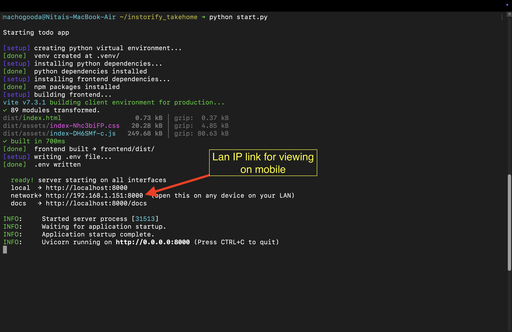
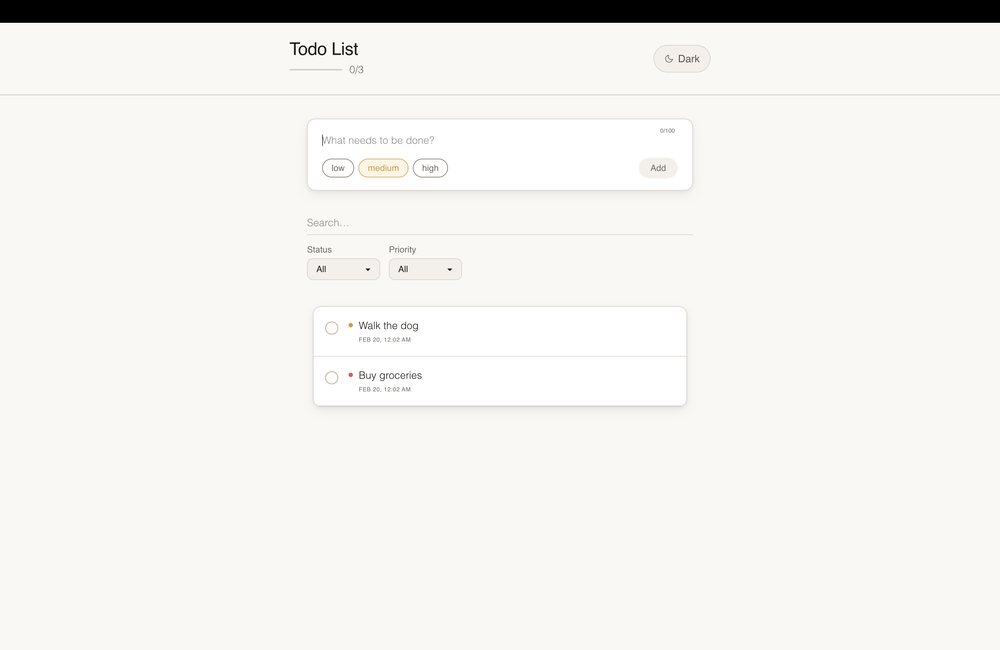
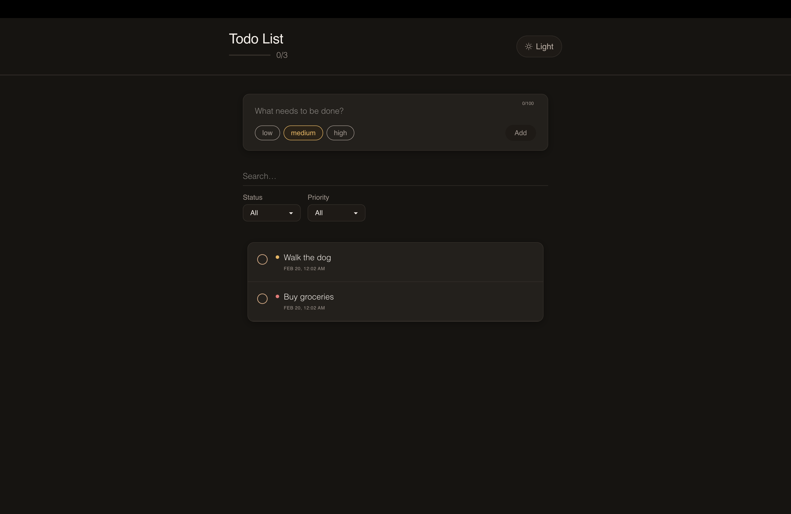
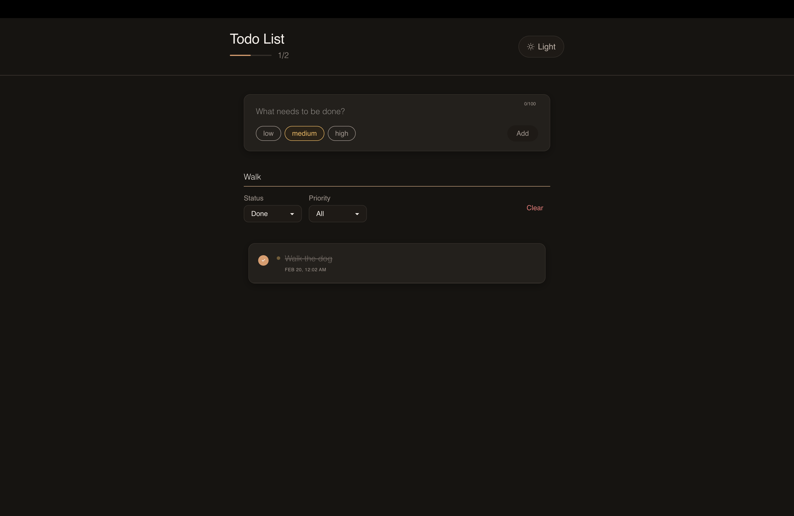

# Todo List App
[](https://python.org)
[](https://fastapi.tiangolo.com)
[](https://reactjs.org)
[](https://tailwindcss.com)

A todo list application built as a take home assignment for InStorify.
The project features an API built with FastAPI and SQLite, paired with a React frontend

---

## Features

### API Endpoints
+ `POST /api/todos` — create a new todo item
+ `GET /api/todos` — get all todos (along with filtering by status, priority, and search)
+ `GET /api/todos/:id` — get a specific todo by ID
+ `PUT /api/todos/:id` — update a todo's title, completion status, or priority
+ `DELETE /api/todos/:id` — delete a todo
+ `GET /api/todos/stats` — get counts of completed vs pending todos, broken down by priority


### Backend
+ Created in Python with FastAPI
+ Along with pydantic, sqlalchemy for data handling and database orm
+ Tests done with pytest
+ Flake8 formatted code
+ Easily scalable and improvable structuring for more endpoints
+ Proper model and schema handling, making sure all data is validated
+ Proper usage of status codes
+ Proper docstrings and formatting for all functions


### Frontend
+ Created with JavaScript and Vite as build tool 
+ Frameworks and packages used: 
    + React, tailwindcss for frontend
    + Axios for data fetching
+ Simple and clean ui with light and dark mode toggle
+ Ability to add todos with priority selection options of low, medium, and, high
+ Inline editing
+ Filter by status of pending/completed and by priority
+ Toast notifications for all actions
+ Responsiveness for desktop and mobile

### Bonus features implemented
+ Priority field with color coded indicators
+ Filtering functionality
+ Search functionality
+ `GET /api/todos/stats` endpoint to show count of completed tasks
+ Data persists between restarts with an SQLite file
+ Dark mode toggle

---

## Project Structure

```
├── backend/
│   ├── app/
│   │   ├── config.py
│   │   ├── database.py
│   │   ├── main.py
│   │   ├── models.py
│   │   ├── schemas.py
│   │   └── routes/
│   │       └── todos.py
│   └── tests/
│       └── test_todos.py
├── frontend/
│   └── src/
│       ├── components/
│       ├── services/
│       │   └── api.js
│       ├── App.jsx
│       ├── ThemeContext.jsx
│       └── index.css
├── requirements.txt
├── start.py
└── test.py
```

---

## Installation & Running

### Requirements
+ Python 3.8+
+ Node.js 18+ and npm

### Start the app

```bash
python start.py
```

And that is it. The script will automatically:
1. Create a Python virtual environment
2. Install all Python dependencies
3. Install frontend npm packages
4. Build the React frontend
5. Start the server at **http://localhost:8000**

API docs are at **http://localhost:8000/docs**

You can also visit the link at ```http://{LAN_IP}:8000``` as given in the startup to view the site from another device on the same network. This is useful for testing directly on mobile if needed rather than using inspect tools on desktop.

LAN IP link location:


(You can also find the LAN_IP link in the .env file upon startup if you miss it in the terminal on startup)

The app works out of the box, but you can customize these in a .env:
- `VITE_API_URL` - Change  URL (default: http://localhost:8000/api)
- `DATABASE_URL` - SQLite path (default: data/todos.db)
- `FRONTEND_URL` - Frontend URL for CORS validation in backend

---

## Running the Tests

```bash
python test.py
```

The test runner sets up the environment automatically and runs the full test against an in memory SQLite database.

You can view the details of the tests at: ```backend/tests/test_todos.py```

---

## API Endpoint Details

| Method | Endpoint | Description |
|--------|----------|-------------|
| `GET` | `/api/todos` | Get all todos. Optional query params: `?completed=true/false`, `?priority=low/medium/high`, `?search=text` |
| `POST` | `/api/todos` | Create a todo. Body: `{ "title": "...", "priority": "medium", "completed": false }` |
| `GET` | `/api/todos/:id` | Get a single todo by ID |
| `PUT` | `/api/todos/:id` | Update a todo. All fields optional: `title`, `completed`, `priority` |
| `DELETE` | `/api/todos/:id` | Delete a todo. Returns 204 No Content |
| `GET` | `/api/todos/stats` | Returns `{ total, completed, pending, priority: { low, medium, high } }` |

All endpoints return appropriate HTTP status codes, `201` on creation, `404` when a todo isn't found, `422` on validation errors, and so on.

---

## Screenshots showcase
Light Mode


Dark Mode


Completed Task


Filtering


---

## Assumptions and Decisions

+ **FastAPI over Express with Nodejs**: I was initially going to do the project with js and express, but upon seeing the need for tests and data validation, I decided it would be easier to do so with FastAPI, as I'm more used to pytest for testing, and, easy data validation with pydantic.

+ **Put vs Patch Methods**: I realized that the instructions said that the update endpoint should be a PUT method, but it didn't make sense for me to change all the information in the todo when updating, so to maintain the rules of method, I kept it as a PUT method but used PATCH style optional handling, as FastAPI has no problem with this.

+ **SQLite over in memory storage**: The instructions allowed in memory storage, but the bonus included an option to store data in a file and since SQLite is simply just a file, I thought it would a good choice, rather than just throwing all the json into a file and parsing it on server restart.

+ **Frontend served by FastAPI**: rather than running two separate servers, the built React app is served as static files by the same FastAPI process. Simpler setup for evaluators.

+ **Cross platform scripts**: `start.py` and `test.py` are plain Python instead of shell scripts so they work on Windows, or unix based os'. I originally planned to do a simple docker container to have a 1 command startup, but decided against it since I'm not sure if the evaluator would have docker installed, and having to install it would add more of a hassle.

## What I'd add with more time

+ User authentication/login system
+ Due dates with sorting and overdue indicators
+ Drag and drop reordering of todo items, to name a few

I faced some challenges in certain decisions in the backend, and some frontend design struggles. As well as creating the startup and test files, making sure its easily runnable without worry about the os, having to do some research and figure out the best way to present it. I also managed to get the frontend quite messy, not properly reusing certain things that are repeated, and not handling toast notifications and proper validation for all cases (hardcoding text length values when I could have properly used useLayoutEffect and made text limit dynamic with a bigger limit in the backend). So organization, better comments, and, better readability is something I would defintely work better on, had I more time.

## Conclusion

Overall, this was an amazingly fun project, coming back to the basics and seeing how far I could push it in a given timeframe. And I'm happy for this opportunity, and hope to bring more to the table at inStorify.

---

## Author
+ Nitai Gauramani


